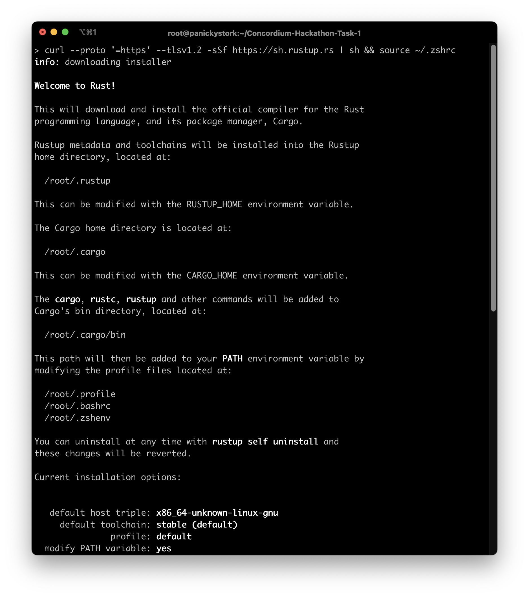
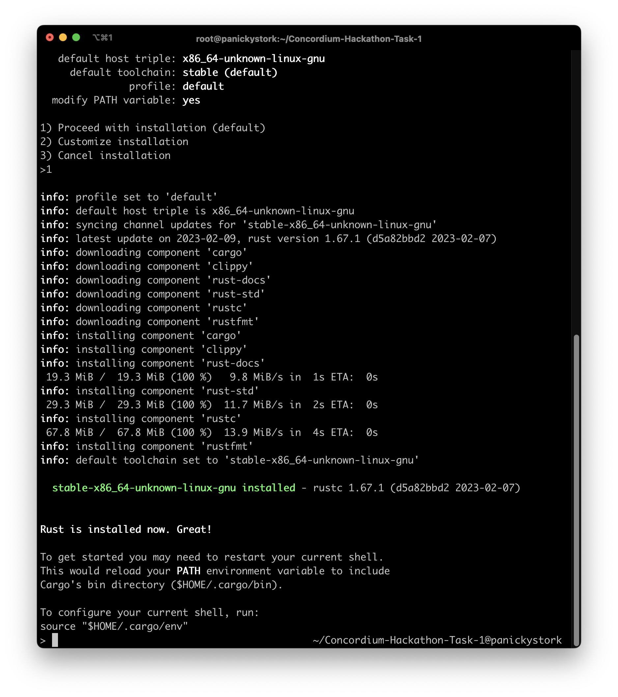
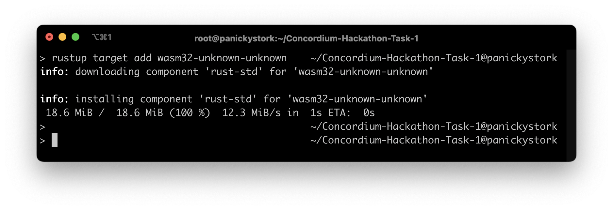
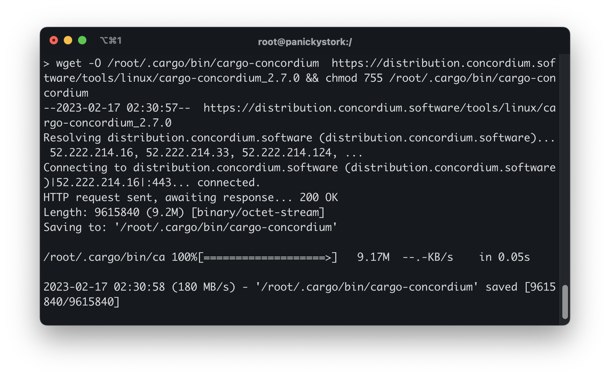
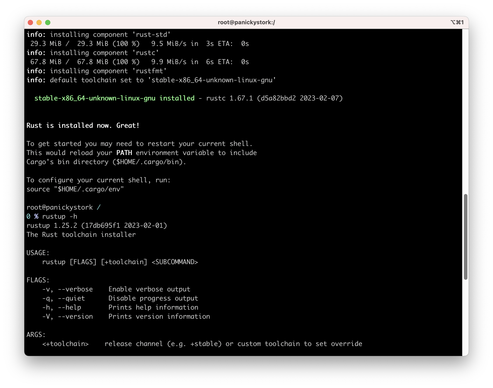
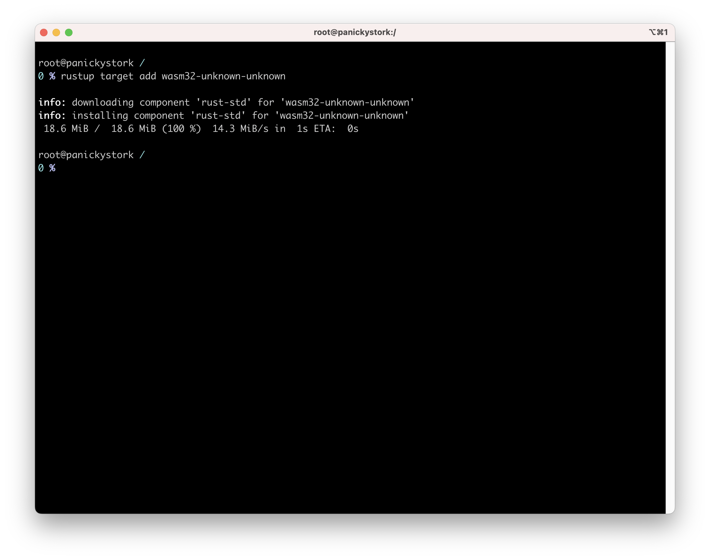
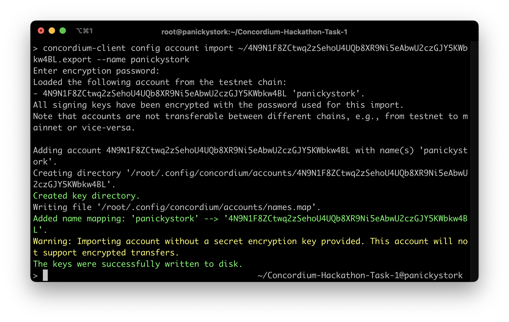

# Concordium Development Environment 
### 1: Install Rust
the instructions on this website: https://www.rust-lang.org/tools/install

### 2: Install cargo-concordium
cargo-concordium is a command-line tool that provides several features, including compiling smart contracts, deploying them to the Concordium network, and managing accounts. 

### 3: Install Concordium-client
to install, go to the website: https://github.com/Concordium/concordium-client/releases

### Create a Testnet account and acquiring testnet CCD via the CCD faucet
To create a Testnet account, please follow the instructions on this website: https://developer.concordium.software/docs/quick-start/testnet-accounts/

Once you have created your account, you can acquire testnet CCD by visiting the following website: https://faucet.concordium.software/

### 5: Export the account from web wallet and import it into Concordium client
- export instructions on this website: https://developer.concordium.software/docs/quick-start/testnet-accounts/

- import  instructions on this website: https://developer.concordium.software/docs/concordium-client/importing-an-account/

### Mainnet
38N6udxcKW1fS6wgPDXt659b7NjZnd5cgxR4RXjZhMFD1Hzgri
