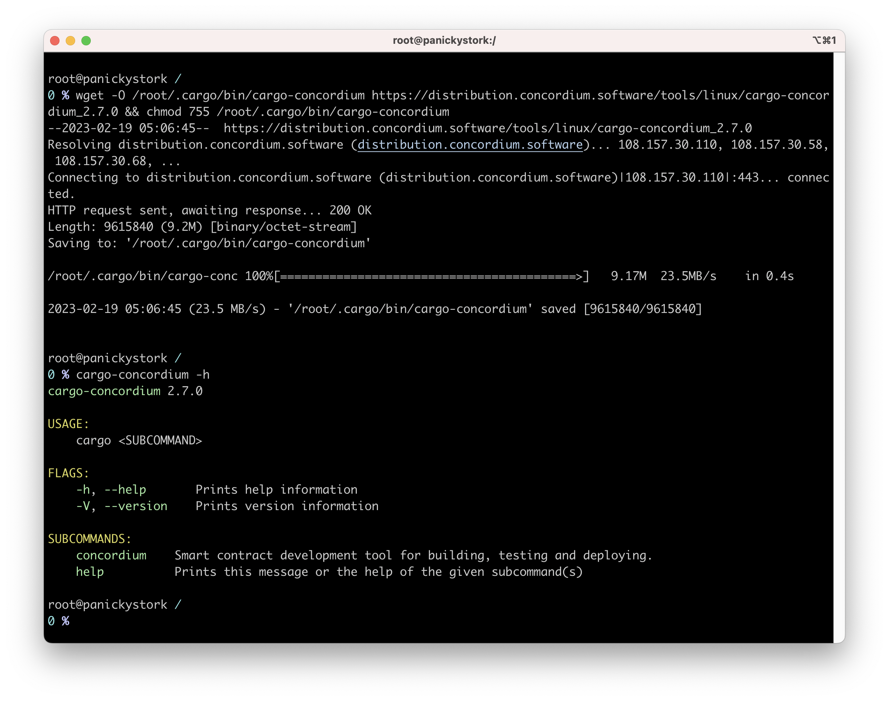

## Mainnet account CCD
38N6udxcKW1fS6wgPDXt659b7NjZnd5cgxR4RXjZhMFD1Hzgri
## Concordium Development Environment
### 1: Install Rust
the instructions on this website: https://www.rust-lang.org/tools/install

### 2: Install cargo-concordium
cargo-concordium is a command-line tool that provides several features, including compiling smart contracts, deploying them to the Concordium network, and managing accounts. 

### 3: Install Concordium-client

### Create a Testnet account and acquiring testnet CCD via the CCD faucet

### 5: Export the account from web wallet and import it into Concordium client

